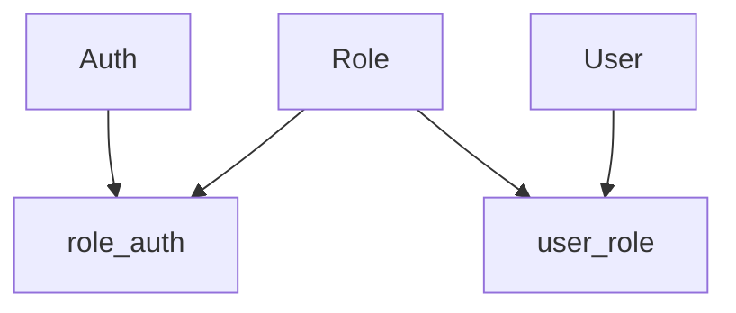

# README

此專案結合Springboot+SpringSecurity+Mybatis+JWT(Java Web Token)+使用RBAC(5張表)

#### 項目更新

2020.01.20 	新增RememberMe功能

2020.01.21	新增日誌功能

#### 專案結構


#### 簡介

這裡使用RBAC0基本模型

*模型中將權限賦予給角色，再將角色賦予給用戶。用戶和角色、角色和權限皆為多對多的關係。*

*用戶擁有的權限  =  用戶所有的角色持有的權限之和*

基本需要五張表，三張表對應Auth(權限),Role(角色),User(用戶)，另兩張為關聯表user_role,role_auth




**Domain**中對應是三張表Auth(權限),Role(角色),User(用戶)的映射

​	這裡的User 同時也繼承UserDetail，實現了UserDetail的六個方法(網路上許多文章中都會再創一個類來繼承，)

*由於UserDetailsService最終是以UserDetail回傳，若希望擴展登入時加載的用戶信息，便需要實現UserDetail接口，定義包含所有業務數據。UserDetail共聲明了六個方法*

```
    GrantedAuthority[] getAuthorities(); 用戶擁有的權限
    String getPassword();	用戶名
    String getUsername();	密碼
    boolean isAccountNonExpired();	用戶帳號是否過期
    boolean isAccountNonLocked();	用戶帳號是否被鎖定
    boolean isCredentialsNonExpired();	用戶憑證是否過期
    boolean isEnabled();	用戶是否可用
```

**Mapper**中的是Mybatis的自定義sql語句，基本的crud來直接操作數據庫

​	UserMapper 

**Service**

​	MyUserDetailService

​	1.更改密碼、用戶註冊、基本查詢等邏輯

​	2.繼承UserDetailsService，實作loadUserByUsername(String username)，再進行CustomAuthenticationProvider校驗時會通過此方法來查詢用信息

*Spring Security 可以透過loadUserByUsername(String username)，去"記錄使用者資訊的地方"(依照你所設定的數據源，ex 資料庫、xml等)尋找對應的使用者，然後將找到的使用者資訊以`UserDetails`的形式回傳給`AuthenticationProvider`（的實作）進行接下來的驗證*

**Controller**

​	無須權限的api都寫在Controller，前綴為(/api)

​	需要權限的api都寫在SecurityController，前綴為(/sec)

**Filter**

​	JWTLoginFilter  繼承UsernamePasswordAuthenticationFilter的自定義登入過濾器，攔截登入請求時:

​	1.設置登入的請求方式，也就是要攔截那些請求

​	2.調用CustomAuthenticationProvider進行校驗

​	3.校驗成功調用successfulAuthentication方法，並生成token

​		校驗失敗調用unsuccessfulAuthentication方法，並回傳原因

*記得要在這裡配置getAuthenticationManager().authenticate(authRequest)，若沒有配置他會直接默認直接成功，而且自定義的provider直接忽略。*

​	JWTAuthorizationFilter 繼承BasicAuthenticationFilter的自定義請求過濾器

*(在網路上也有看到繼承別的filter，目前不太確定繼承的原因，推測是考慮到BasicAuthenticationFilter的順序在UsernamePasswordAuthenticationFilter之後的因素才繼承，所以個人認為只要確保過濾器順序即可，但有新的論述請指正謝謝)*

每一次需要權限的請求(SecurityController中的api)都需要驗證token的正確性(是否過期、權限是否相符、token是否正確)

**Provider**

​	CustomAuthenticationProvider 實現AuthenticationProvider接口的自定義驗證器

*AuthenticationProvider是由 AuthenticationManager 来管理的，可以多配置自定義不同種驗證方式的Provider(圖形驗證....等)，*

CustomAuthenticationProvider 中，主要實現AuthenticationProvider兩種方法

​	authenticate(Authentication authentication)

​		這裡主要是撰寫驗證帳號的一些判定(是否為空、密碼比對、用戶是否鎖定之類的)，值得注意的是，

由於資料庫裡儲存的密碼都是加密過的，在這裡比對密碼時就必須將前端傳入的密碼加密後再進行比對。

​	supports(Class<?> authentication)

​		這個方法我還在理解，就目前的理解為如果這個AuthenticationProvider支持指定的身份验证对象，那么返回true。從JWTLoginFilter  傳進來的是UsernamePasswordAuthenticationToken格式，則在這裡

```
return authentication.equals(UsernamePasswordAuthenticationToken.class);
```

若為UsernamePasswordAuthenticationToken則為true。當然也可以直接回傳true也行，就是所有都放行的意思。

**Security**

​	JWTUtil 用來製作token的工具類以及設定token存活時間設定。

​	SecurityConfig  Spring Security核心類，繼承 WebSecurityConfigurerAdapter，記得加上@EnableWebSecurity來啟動

​	*@EnableWebSecurity為一個組合註解*

```
@Import({ WebSecurityConfiguration.class,
		SpringWebMvcImportSelector.class }) 
@EnableGlobalAuthentication 
@Configurationpublic @interface EnableWebSecurity {  
boolean debug() default false;}
```

http://blog.didispace.com/xjf-spring-security-3/  詳解請看這個大佬

WebSecurityConfigurerAdapter的三個方法

​	void configure(AuthenticationManagerBuilder auth) 

用來配置驗證管理器AuthenticationManager，其中包含驗證器配置，PasswordEncoder也可以配置在這，在這裡還可以有多種實現(自定義帳號密碼直接寫死，常用的簡單userDetailsService直接配置也行)，白話的說有關於驗證的都在這裡。

​	void configure(WebSecurity web)

用來配置WebSecurity，而WebSecurity是基於Servlet Filter來配置springSecurityFilterChain，而springSecurityFilterChain被委任給DelegatingFilterProxy，一般不過多在這裡配置，在這較常用ignoring()來忽略 Spring Security 對靜態資源的控制。

​	void configure(HttpSecurity http)

用来配置 HttpSecurity，這方法是配置最多的地方，用於構建SecurityFilterChain。可以通過它來配置自定義安全策略。此方法還有一關鍵的配置，addfilter,addFilterBefore,addFilterAfter之類的添加自定義過濾器。達到靈活控制過濾器順序的效果。


*https://www.jianshu.com/p/e6655328b211 大佬在這，有關於SecurityConfig 寫得很詳細*

**application.properties**

也可寫成application.yml，可以配置數據庫的設定

```
spring.datasource.url=
jdbc:mysql://Hostname:Port/數據庫名?useUnicode=true&characterEncoding=UTF-8&useSSL=false&serverTimezone=UTC
spring.datasource.username=數據庫帳號
spring.datasource.password=數據庫密碼
spring.datasource.driver-class-name=com.mysql.cj.jdbc.Driver 驅動程式
```

https://www.jianshu.com/p/5a62b8dc02f3 大佬在這，application詳細配置


#### 功能特性

​		/api 任何人都可訪問

​		/sec 特定權限訪問


**登入(/permit/login,POST&GET)**

​	需要傳入參數

​	username

​	password

​	remember_me

由於結合了spring security，不同於以往的api寫在controller中，儘管不能夠自由的修改，但了解大部分的控制依然能達到修改的效果。

spring security 默認提交登入表單的url為(/login)，在這更改為(/permit/login)，我是配製在JWTLoginFilter中。另外，可以在JWTLoginFilter配置限定POST方法或GET方法，這裡沒有配置所以都可以。

remember_me 在JWTLoginFilter驗證成功時調用的successfulAuthentication方法，由於是用HttpServletRequest.getParameter("remember_me")若checkbox有勾選會回傳字串"on"，這裡默認不是on的一律為false


**註冊(/api/register,POST)**

​	需要傳入參數

​	username	(帳號

​	name	(真實姓名

​	password	(密碼

只要填入以上三個參數即可，其他會默認配置，這裡密碼會直接加密(BCryptPasswordEncoder.encode())

*加密方式可以直接在SecurityConfig中可以任意更改配置*

權限配置要自己手動進資料庫去設定，但是若是都沒配置，在JWTLoginFilter驗證成功時調用的successfulAuthentication方法中，有默認為若都沒有抓到該帳戶有任何權限，會自動配置"ROLE_USER"


**更改密碼(/api/modify,POST)**

​	需要傳入參數

​	username	(帳號

​	password	(密碼

此方法僅用來測試無需權限即可操作，一樣密碼會直接加密(BCryptPasswordEncoder.encode())


**檢查權限(/api/checkAuth,GET)**

​	需要帶token

根據帶入的token解析出當前token的權限


**通道健康檢測(/sec/healthcheck,GET){hasRole('USER')}限定ROLE_USER**

​	需要帶token

成功時回傳"success"'


**檢查用戶權限細節**

​	需要帶token

根據帶入的token解析出當前token的一些資料(到期時間、用戶權限及一些細節)